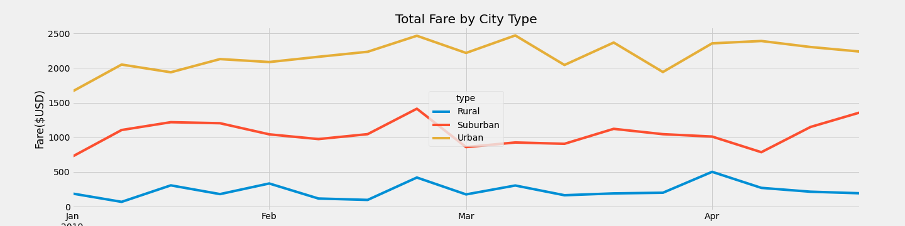

# PyBer Analysis

## Overview of Analysis
The purpose is to analyse data of ride sharing information throughout several city types. Comparison of fares, drivers, and location will be used to create a visualization that will help make future decisions for PyBer.

## Results
* Rural city types had the highest average fare per ride but also the highest average fare per driver with the lowest amount of rides.
* Suburban city types had higher amount of total rides and better ratio of average fare per ride / average fare per driver than rural cities. 
* Urban city types are the most profitable with the most total rides and better average fare per ride / average fare per driver ratio than all city types.

## Summary 
Reading the information and revising the data, one can come up with several decisions that can be considered for the future. Given that the ratio is higher for profits in urban cities, the concentration of the business should be there. Regarding rural areas, it makes sense there are less drivers and with longer distances for drop offs. I would suggest provide the services in more dense rural areas and have less average fare per driver. Another suggestion will include to focus more in suburban and urban cities as they are the most porfitable. Create a core customer base where it is the strongest before trying to break in with all force in the rural cities. 
